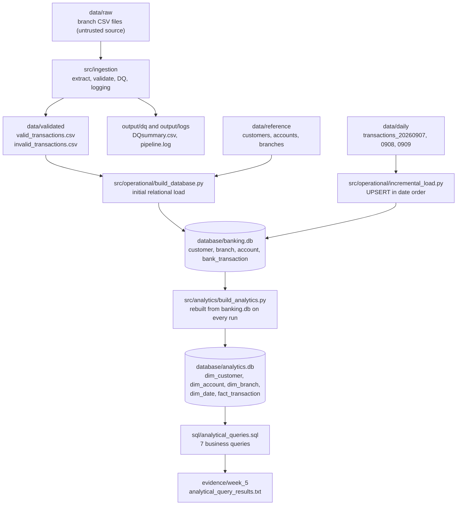

# Data Lineage

## End-to-End Data Flow

## Stages

1. **Ingestion and validation:** branch files in `data/raw` are read, validated and split into valid and invalid rows. Logs and the DQ summary go to `output/`.
2. **Initial load:** the valid rows and the reference files build `banking.db`.
3. **Incremental load:** each daily file is applied to `banking.db` in date order. New transaction IDs are inserted. An existing ID is a correction and is updated, unless the file is older than the one that wrote the stored row.
4. **Analytical build:** `analytics.db` is deleted and rebuilt from `banking.db` only. It never reads the raw branch files.
5. **Analysis:** the queries in `sql/analytical_queries.sql` run against `analytics.db`.

`tests/` verifies each stage, `evidence/` holds the captured proof, and `docs/` holds the diagrams.
