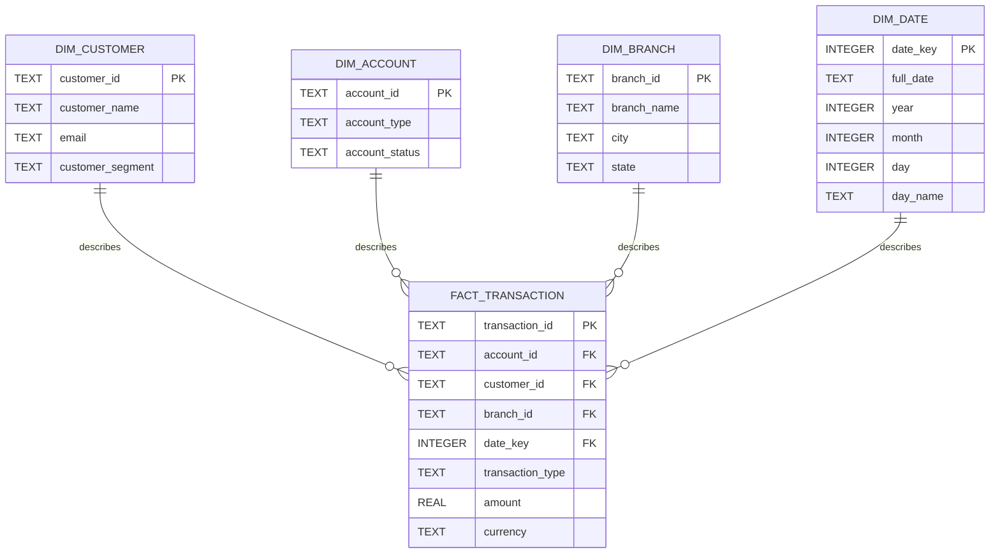

# Star Schema

## Analytics Database Star Schema

Grain of `fact_transaction`: **one row = one banking transaction.**

## Notes

- **Fact:** `fact_transaction` holds the measurable event (`amount`) and the keys that point to each dimension. `transaction_id` is the primary key, so the grain is enforced by the database.
- **Dimensions:** `dim_customer`, `dim_account`, `dim_branch` and `dim_date` describe who, which account, where and when.
- **Natural keys:** the dimensions use the business keys from `banking.db` (no surrogate keys, no history tracking), as the assignment scope requires.
- **Customer and branch** are carried on the fact row. They come from the transaction's account in `banking.db`.
- **`amount` is always positive.** `transaction_type` says whether it is money in (CREDIT) or out (DEBIT), so net cash flow is credits minus debits, not `SUM(amount)`.
